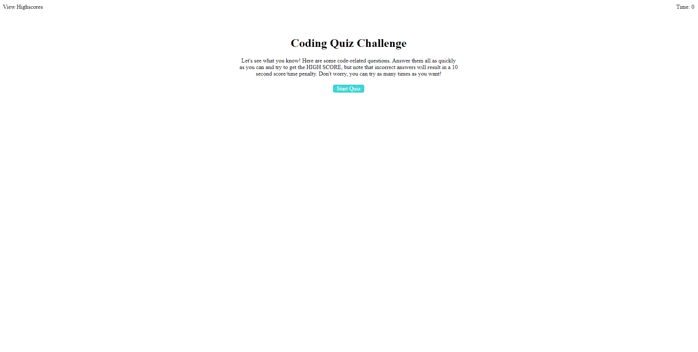

# Project: Web APIs: Code Quiz

  Deployable Link - > https://dingodiie.github.io/Web-APIs-Challenge--Code-Quiz/

## Table of Contents: 
- [Project: Web APIs: Code Quiz](#project-web-apis-code-quiz)
  - [Table of Contents:](#table-of-contents)
  - [Description:](#description)
  - [Github:](#github)
  - [My Email Address:](#my-email-address)
  - [Images:](#images)

## Description:
A coding quiz meant to test a users knowledge of javascript

## Github: 
Check out more projects on my Github at https://github.com/DingodiIe

## My Email Address:
If you have any questions please feel free to email me at GBmbarker@gmail.com

## Images:

